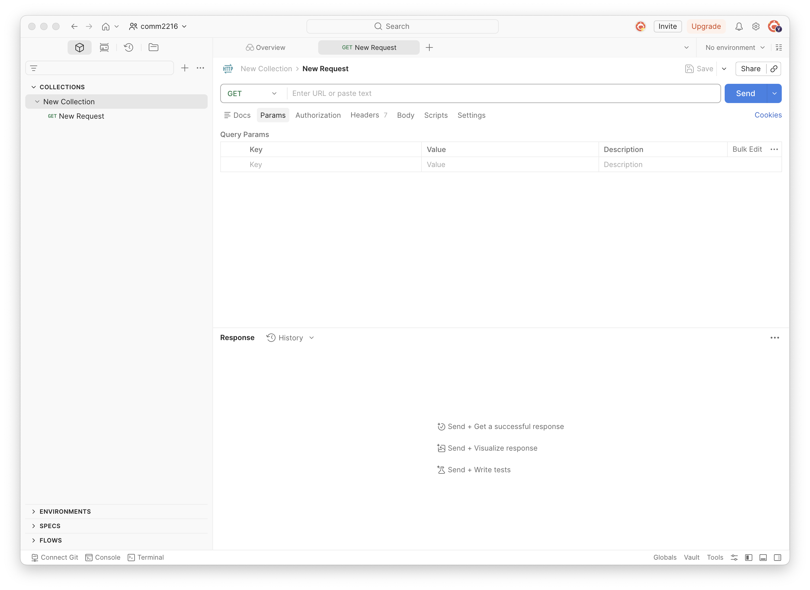
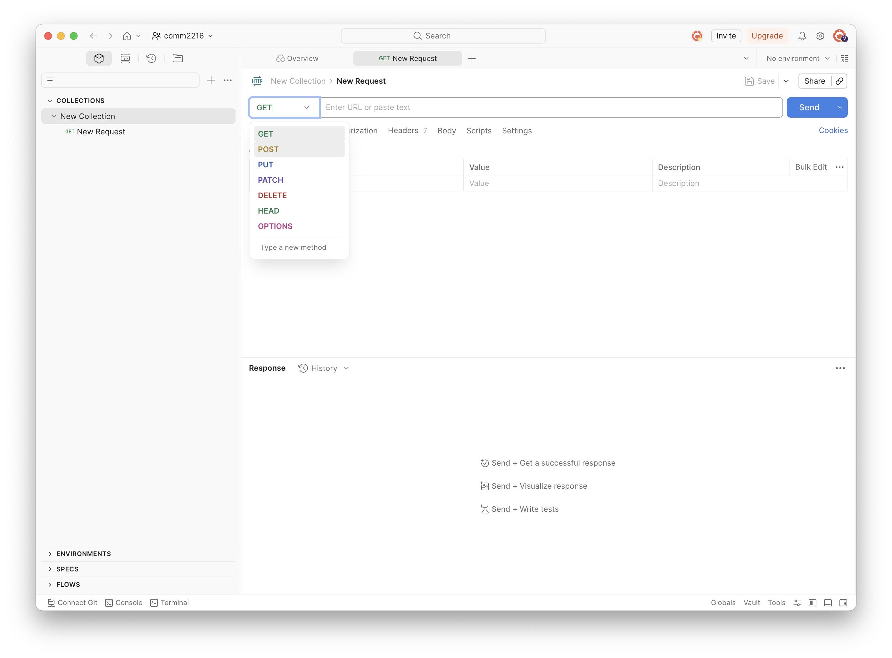
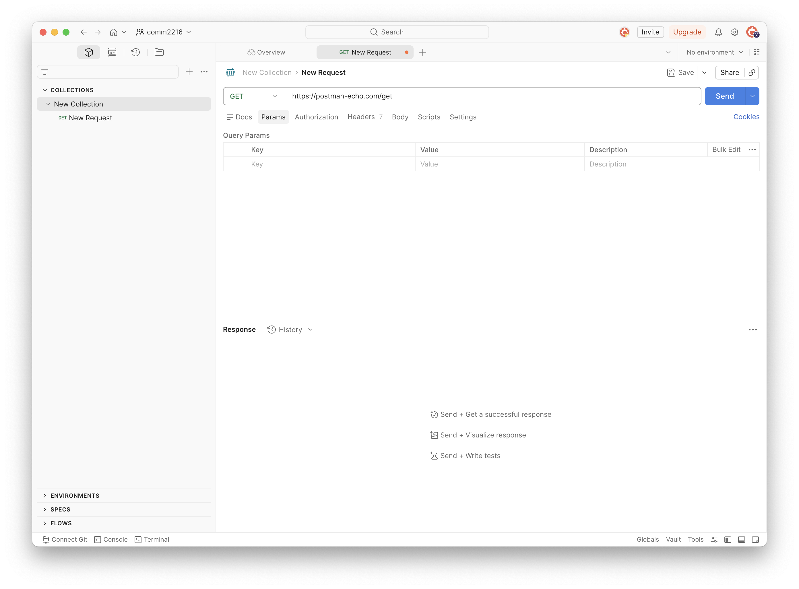
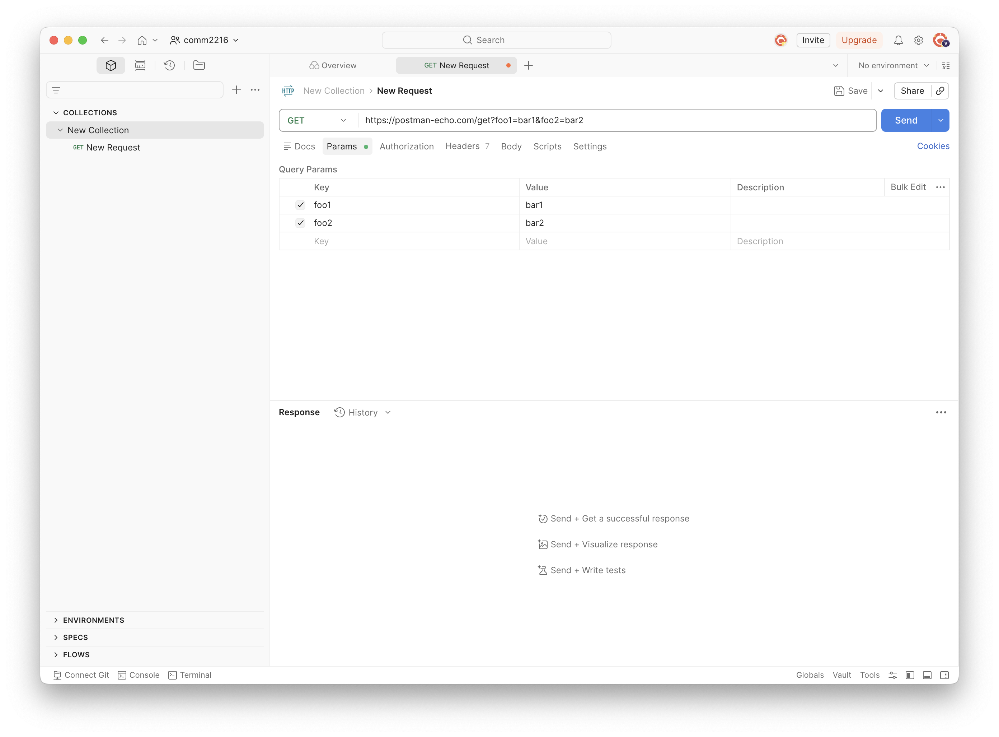
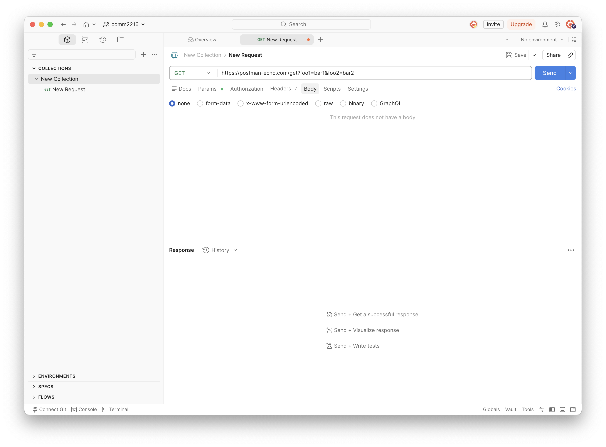
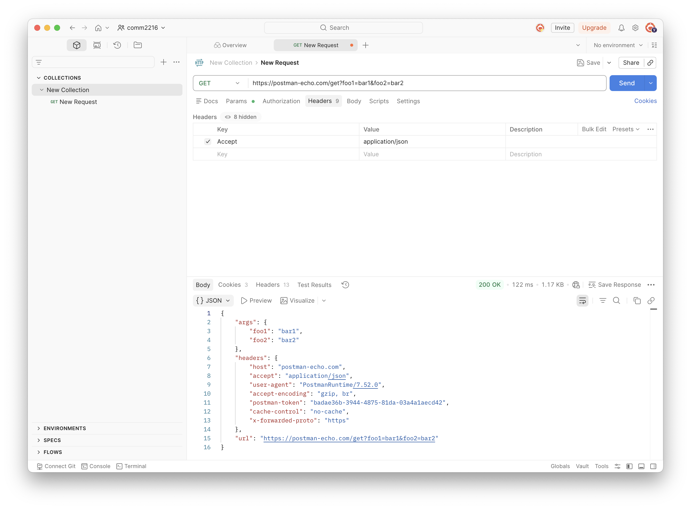
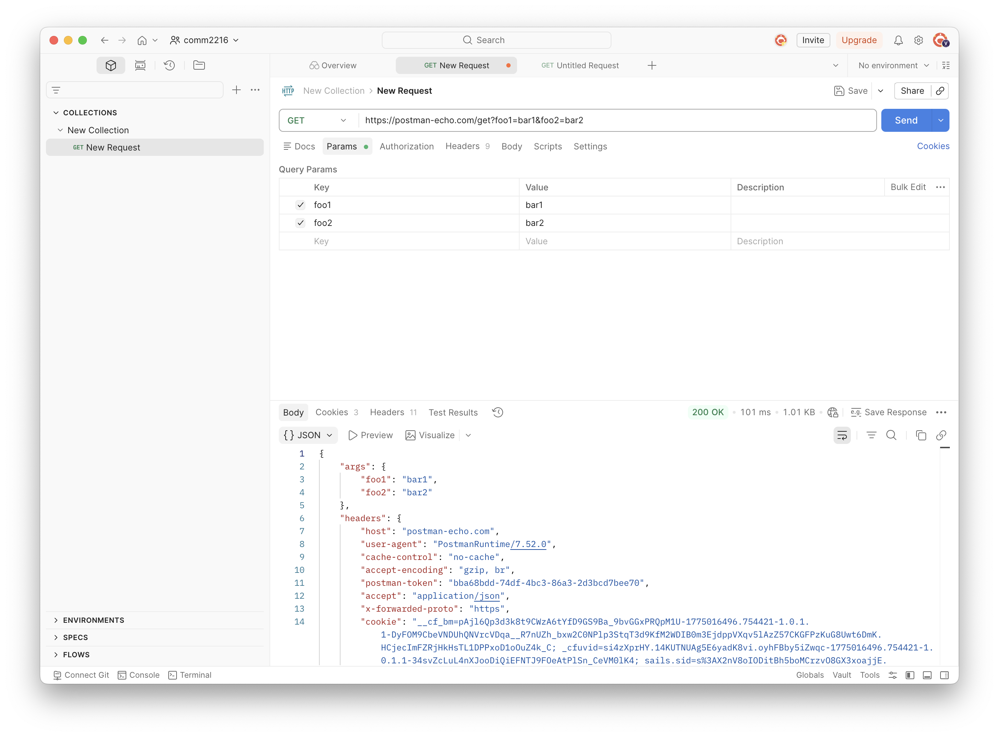
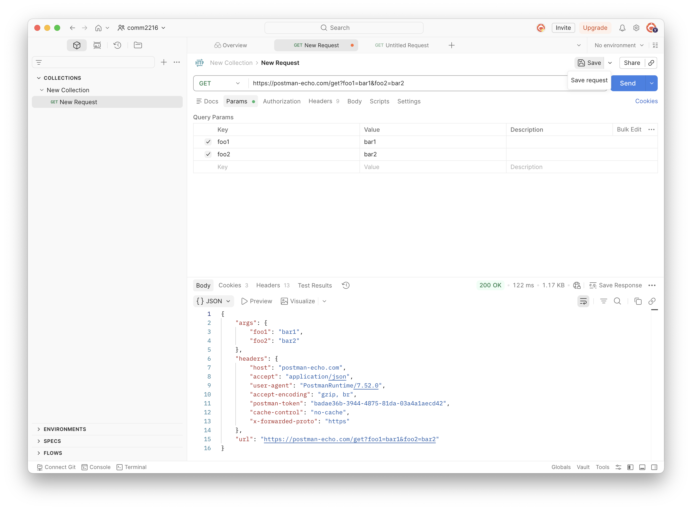
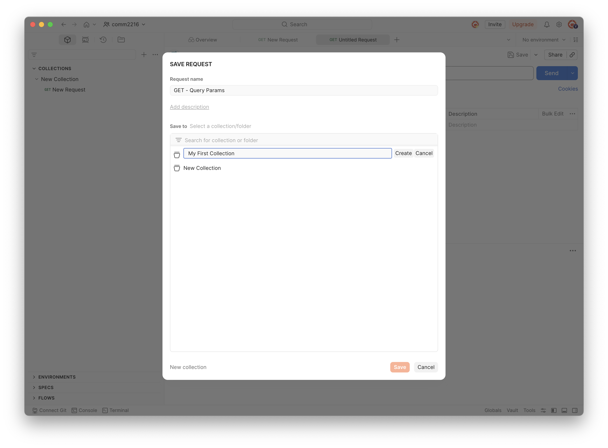

# Sending a GET Request

## Overview

In this section, you will send a GET request to the [**Postman Echo**](https://postman-echo.com/) API.

This section is organized into three parts:

- **Build the Request** — Create a new request, set the method, enter the URL, and configure the query parameters, body, and headers.
- **Send & Review** — Send the request and read the response.
- **Save the Request** — Save the request to a collection for future use.

By the end of this section, you will know how to send a real HTTP request and understand what the response tells you.

!!! info "What is a GET request?"
    A GET request asks a server to **send you data**. It is the most common type of HTTP request — like asking a website to show you a page.

!!! info "What is Postman Echo?"
    Postman Echo is a simple API provided by Postman for testing HTTP requests.

---

## Build the Request

This section covers Steps 1–6: creating the request, choosing the method, entering the URL, and configuring the params, body, and headers.

---

**Step 1 — Create a New Request**

1. Open the **Postman desktop app**.
2. Click the **+** button at the top of the screen to open a new tab.
3. A blank request editor opens.

<!-- *Click the + button at the top of the Postman workspace to open a new request tab.* -->


!!! info
    You can also press ++ctrl+t++ (Windows / Linux) or ++cmd+t++ (macOS) to open a new tab.

---

**Step 2 — Set the Method to GET**

1. Find the **method dropdown** on the left side of the URL bar.
2. By default, Postman sets every new request to **GET**.
3. Confirm it shows **GET**. If not, click the dropdown and select **GET**.

<!-- *The method dropdown is on the left side of the URL bar. Confirm it shows GET.* -->


!!! info "Common HTTP methods"
    | Method | What it does |
    |--------|-------------|
    | **GET** | Retrieve data from the server |
    | **POST** | Send new data to the server |
    | **PUT** | Replace existing data |
    | **PATCH** | Update part of existing data |
    | **DELETE** | Remove data |

---

**Step 3 — Enter the URL**

1. Click the **URL bar** (it shows placeholder text like _Enter URL or paste text_).
2. Type the following URL:

   ```
   https://postman-echo.com/get
   ```

<!-- *Type the base URL into the address bar. Do not add query parameters yet.* -->


<!-- !!! warning
    Do **not** add `?foo1=bar1&foo2=bar2` to the URL yet. You will add query parameters in Step 4 using the Params tab instead. This keeps your request easier to manage. -->

---

**Step 4 — Add Query Parameters**

Query parameters let you pass extra information along with your request. They appear at the end of a URL, after a `?`:

```
https://postman-echo.com/get?foo1=bar1&foo2=bar2
```

Instead of typing parameters directly into the URL, use the **Params** tab. Postman updates the URL automatically.

1. Click the **Params** tab below the URL bar.
2. In the first empty row, enter:
   - **Key:** `foo1`
   - **Value:** `bar1`
3. In the next row, enter:
   - **Key:** `foo2`
   - **Value:** `bar2`
4. Look at the URL bar — it now shows:
   ```
   https://postman-echo.com/get?foo1=bar1&foo2=bar2
   ```

<!-- *Add key-value pairs in the Params tab. Postman builds the URL for you.* -->


!!! info
    Each row in the Params tab has a **checkbox**. When a checkbox is unchecked, that parameter is not sent. This is useful for testing with and without a parameter without deleting it.

---

**Step 5 — Check the Request Body**

1. Click the **Body** tab below the URL bar.
2. Confirm **none** is selected.
3. Leave it as is — no body is needed for this request.

<!-- *For GET requests, the body should always be set to none.* -->


!!! info
    GET requests do not send a body. Body data is used with **POST**, **PUT**, and **PATCH** requests when you need to send data to the server — for example, a new user's name and email in JSON format.

---

**Step 6 — Add a Request**

Headers give the server extra information about your request — for example, what format you want the response in.

1. Click the **Headers** tab below the URL bar.
2. You will see some headers already listed in grey. These are added automatically by Postman and are always sent.
3. In the first empty row, add:
   - **Key:** `Accept`
   - **Value:** `application/json`、

<!-- *Add the Accept header in the Headers tab. Postman auto-fills suggestions as you type.* -->


!!! info
    The `Accept` header tells the server that you want the response in **JSON** format.
<!-- 
!!! info
    As you type in the Key field, Postman shows suggestions like `Content-Type` and `Accept`. Click a suggestion to fill it in automatically. -->

---

## Send & Review

This section covers Steps 1–2: sending the request and reading what comes back.

---

**Step 1 — Send the Request**

1. Click the blue **Send** button on the right side of the URL bar.
2. Postman sends the request to `https://postman-echo.com/get?foo1=bar1&foo2=bar2`.
3. Wait a moment — the response appears in the bottom half of the screen.

<!-- *Click the blue Send button. Postman sends your request to the server.* -->


---

**Step 2 — Read the Response**

After you click Send, the **Response** panel appears at the bottom of the screen. Check the **status code** first, then the **body**.

<!-- **Status Code** -->
Look at the top of the response panel. You should see:

```
200 OK
```

This means the request worked. The server received your request and sent data back.

<!--  -->
<!-- *The status code appears at the top of the response panel. 200 OK means success.* -->

<!-- !!! success
    If you see `200 OK`, your request worked correctly. Move on to read the response body below. -->

!!! info "Common status codes"
    | Code | Meaning |
    |------|---------|
    | **200** | OK — the request worked |
    | **400** | Bad Request — something is wrong with your request |
    | **401** | Unauthorized — you need to provide credentials |
    | **404** | Not Found — the URL does not exist |
    | **500** | Server Error — something went wrong on the server |

    Hover over the status code in Postman to read a short description of what it means.

**Response Body**

1. In the **Response** panel (bottom half of the screen), click the **Body** tab.
2. You should see JSON data like this:

   ```json
   {
     "args": {
       "foo1": "bar1",
       "foo2": "bar2"
     },
     "headers": {
       "host": "postman-echo.com",
       "accept": "application/json"
     },
     "url": "https://postman-echo.com/get?foo1=bar1&foo2=bar2"
   }
   ```


<!-- *Click the Body tab in the response panel to see the data the server sent back.* -->


<!-- !!! success "What does this mean?"
    | Field | What it shows |
    |-------|--------------|
    | `args` | The query parameters you sent: `foo1` and `foo2` |
    | `headers` | The headers your request included, including `Accept` |
    | `url` | The full URL of your request |

If you see `"foo1": "bar1"` and `"foo2": "bar2"` inside `args`, everything worked correctly. -->

<!-- **Other Response Tabs**

| Tab              | What it shows                               |
| ---------------- | ------------------------------------------- |
| **Body**         | The data the server sent back               |
| **Cookies**      | Any cookies returned by the server          |
| **Headers**      | Response headers sent by the server         |
| **Test Results** | Pass/fail results if you added test scripts | -->

---

## Save the Request

**Step 1 — Save the Request**

Saving lets you open and resend the request any time without setting it up again.

1. Click the **Save** button at the top right of the request editor, or press ++ctrl+s++ (Windows / Linux) or ++cmd+s++ (macOS).
2. A **Save Request** dialog opens.

<!-- *Click Save or press Ctrl+S / Cmd+S to open the Save Request dialog.* -->

3. Fill in the details:
   - **Request name:** `GET - Query Params`
   - **Collection:** Click **New Collection**, name it `My First Collection`, and click **Create**. Or select an existing collection.
4. Click **Save**.


<!-- *Enter a name for the request and choose a collection to save it in.* -->

Your request now appears in the left sidebar under your collection. Click it any time to reload it.

!!! info "What is a Collection?"
    A collection is a folder that holds related requests together.
    You can organize, share, and run all requests in a collection at once.

---

## Conclusion

By the end of this section, you will have successfully learned the following:

- How to create and configure a GET request in Postman.
- How to add query parameters, headers, and check the body.
- How to read and understand the server response.
- How to save a request to a collection.

Congratulations! You sent your first API request!

---