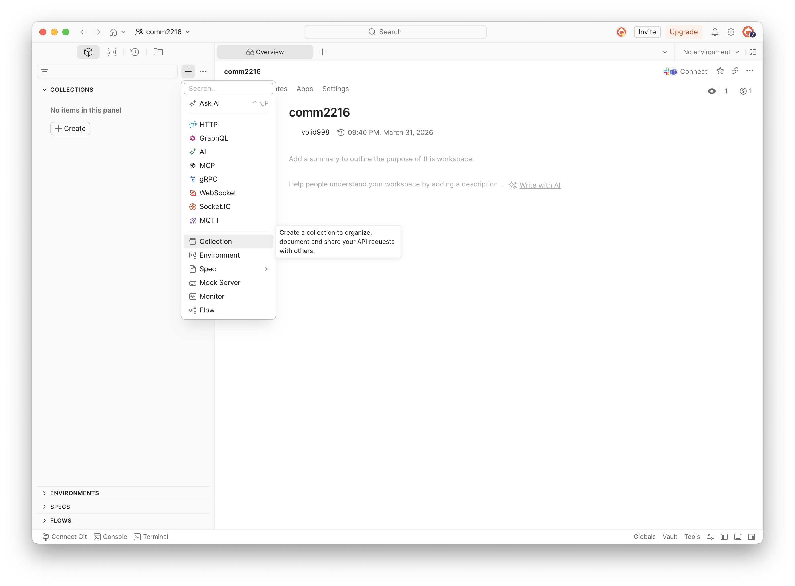
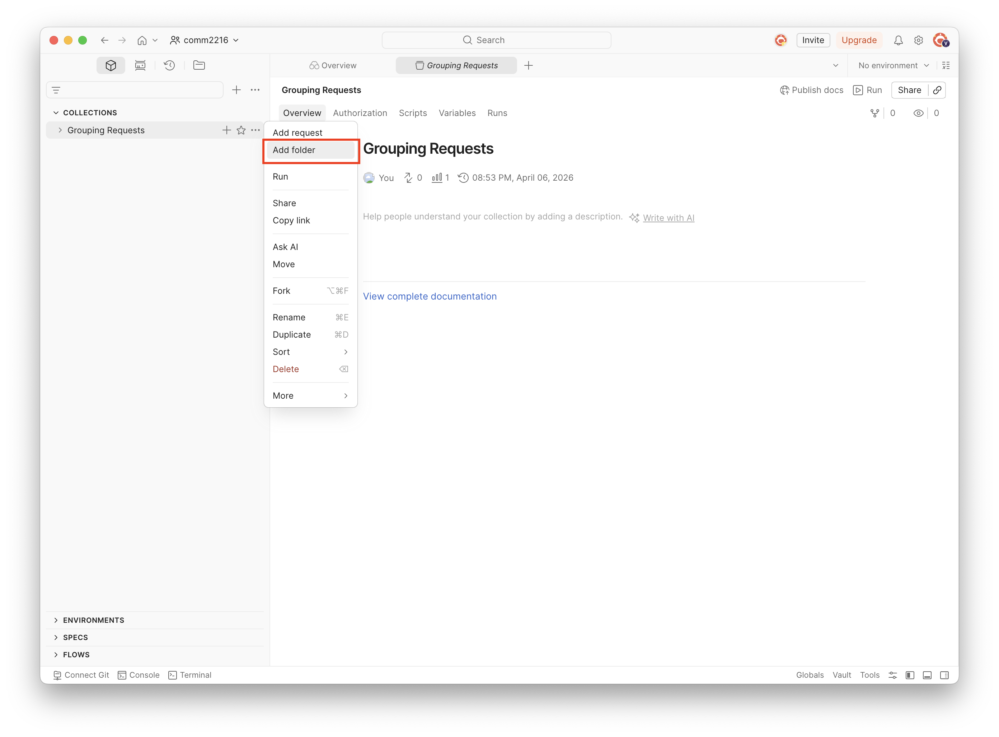
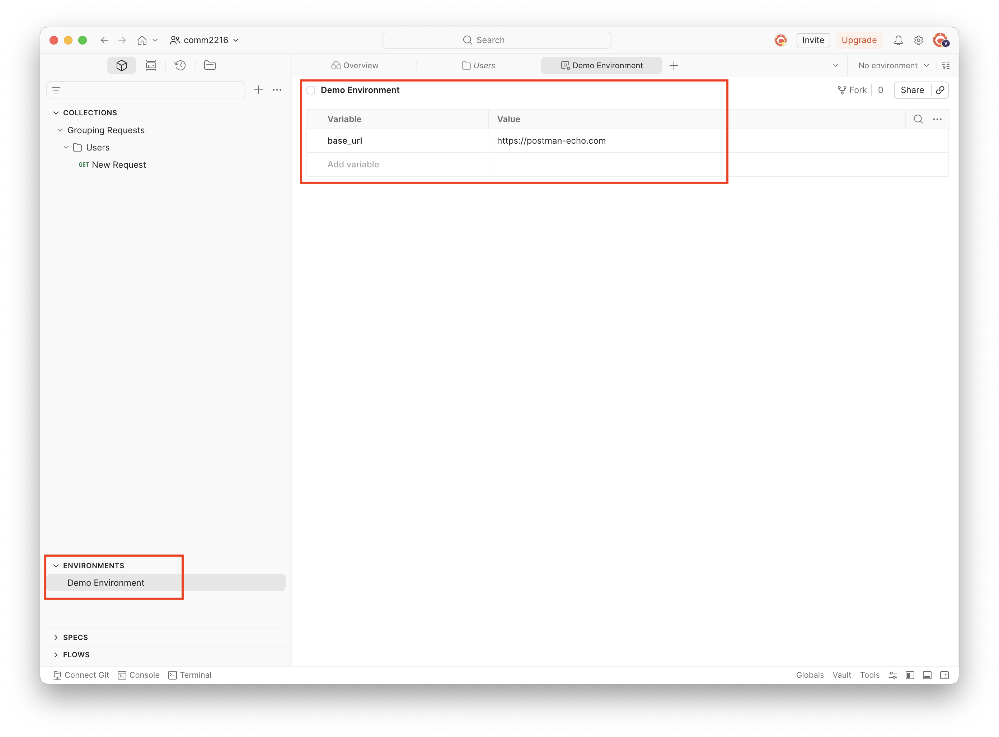
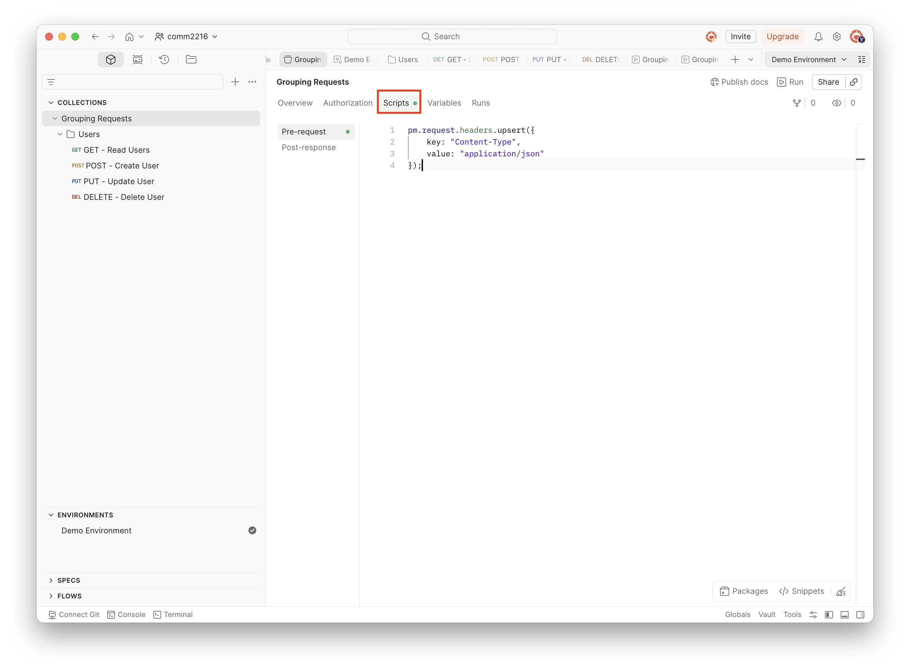
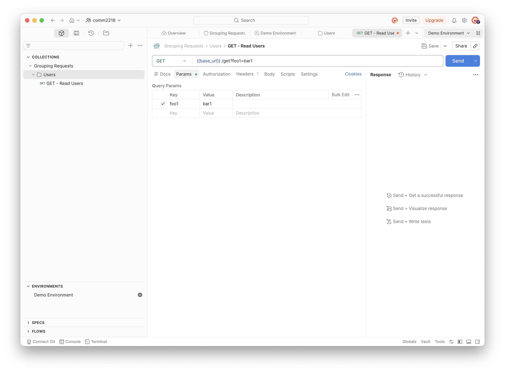
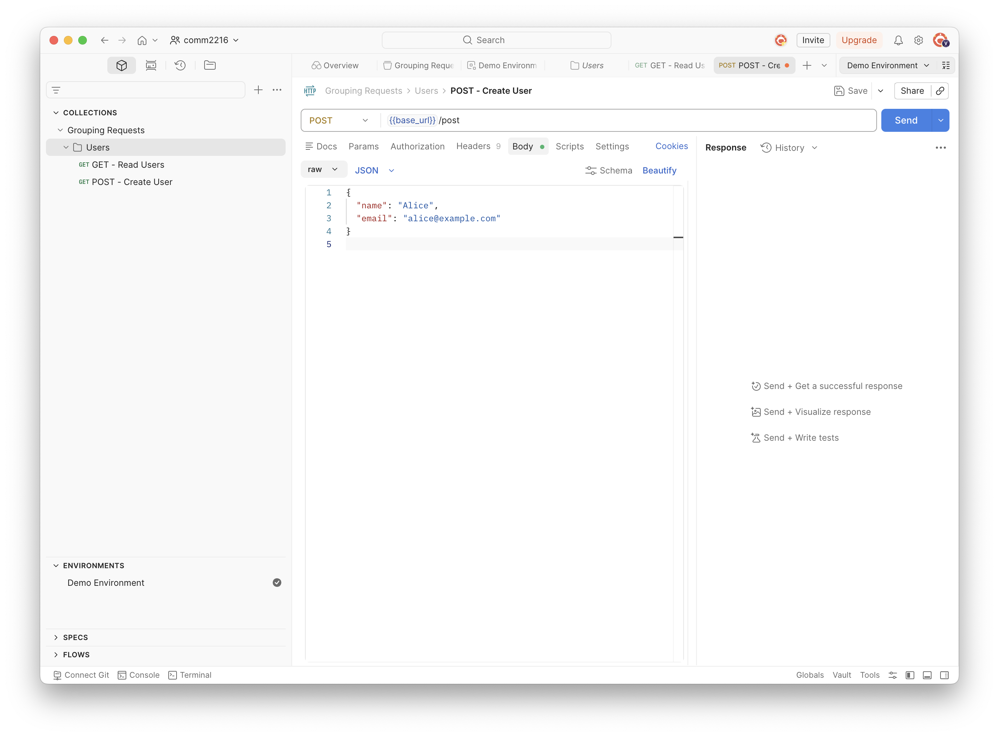
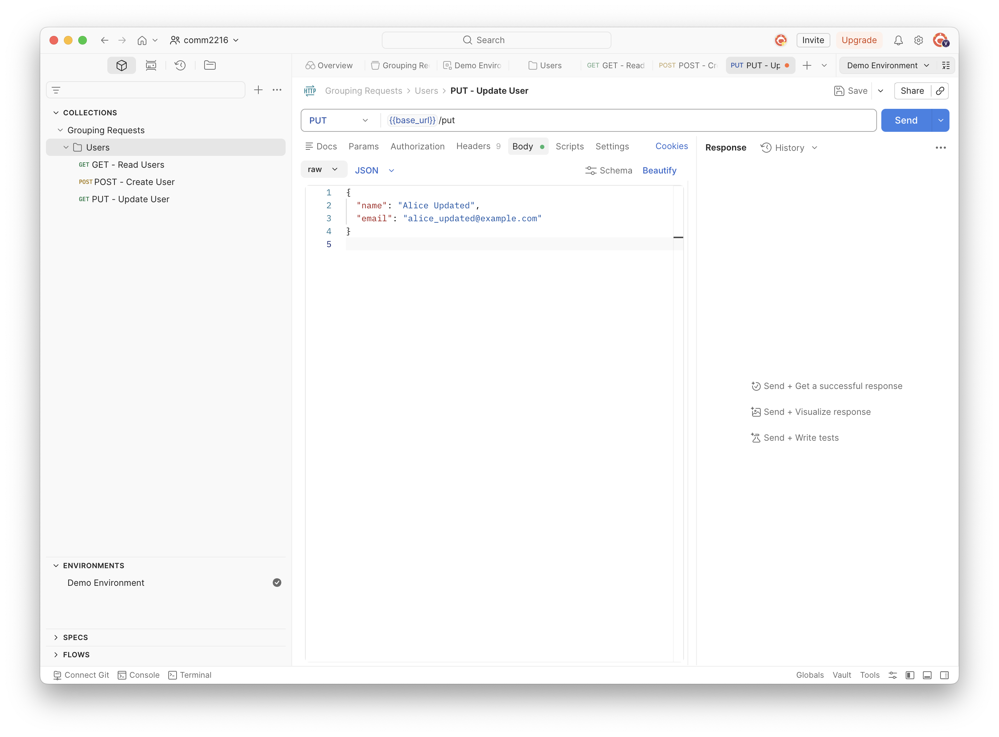
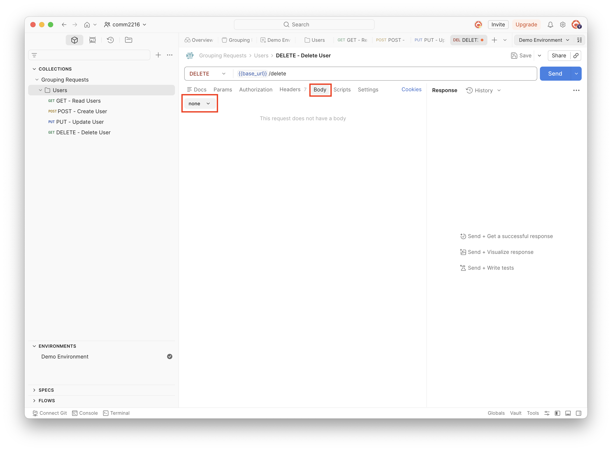
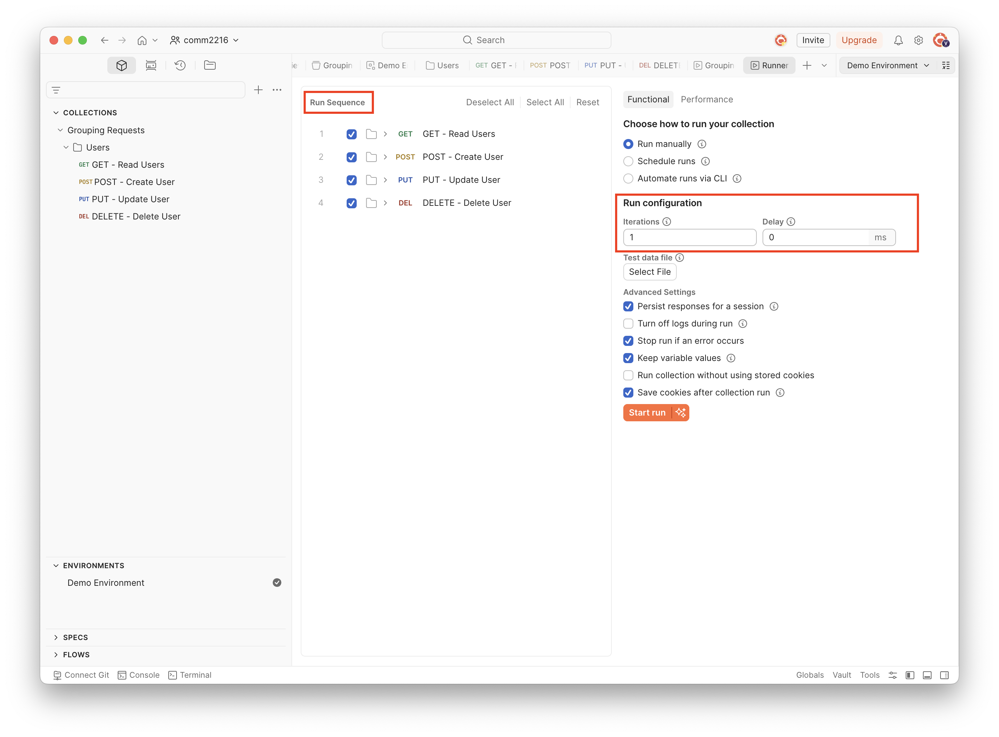
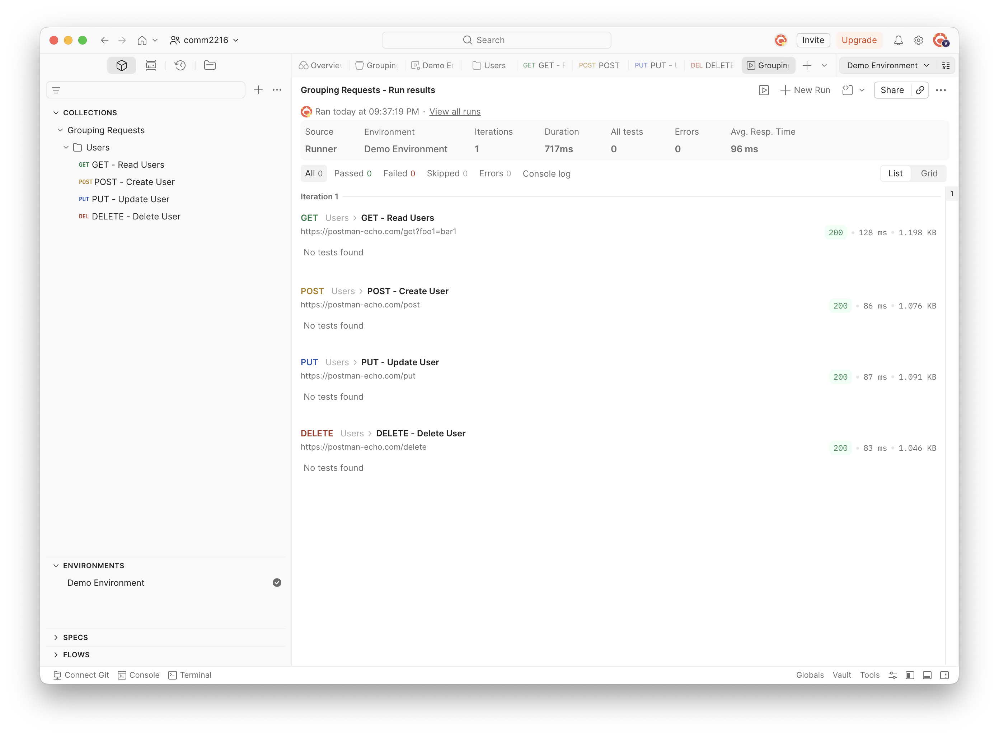

# Grouping Requests with Collections

## Overview

In this section, you will organize API requests using **Collections** — one of Postman's most powerful features for managing and running groups of related requests.

This section is organized into four parts:

- **Set Up** — Create a Collection, add a Folder, and configure a shared environment variable and headers (Steps 1–3).
- **Build the Requests** — Add GET, POST, PUT, and DELETE requests that cover a full CRUD workflow (Steps 1–4).
- **Run the Collection** — Use the Collection Runner to execute all requests at once.
- **Review the Results** — Read the runner output to verify everything worked.

By the end of this section, you will know how to organize related requests into a collection, share configuration across requests, and run a full CRUD test with one click.

!!! info "What is a Collection?"
    A Collection is a folder that holds related requests together. You can share configuration across every request in the collection, and run them all at once.

---

## Set Up

Creating a collection and folder, setting a base URL variable, and adding a shared header help organize requests, reuse common configurations, and ensure consistent API management across different environments and team members.

1. Find the **"COLLECTIONS"** section in the left sidebar and click the **"+"** icon at the top of the sidebar.

2. Select **Collection** from the menu that appears and name it `Grouping Requests`.

    

3. Right-click the `Grouping Requests` collection in the sidebar.

4. Select **"Add Folder"** and name the folder `Users`.

    

5. Store the base URL in a **variable** instead of typing the full URL into every request.

    - To Create an Environment with `base_url`:

        1. Scroll down to find the **"ENVIRONMENTS"** section at the bottom.

        2. Click the **"+"** icon to open a new environment tab. Name it `Demo Environment` at the top of the editor.

        3. Add a row in the variable table:
            - **Variable:** `base_url`
            - **Value:** `https://postman-echo.com`
        4. Click **"Save"** .

    

    - To Add a Shared Header to the Collection**

        1. Click the `Grouping Requests` collection name in the sidebar to open it.
        2. Click the **Scripts** tab (in the tab row below the collection name).
        3. Click **Pre-request** inside the Scripts tab.
        4. Type the following script into the editor:

            ```javascript
            pm.request.headers.upsert({
                key: "Content-Type",
                value: "application/json"
            });
            ```

        5. Click **Save**.

    

<!-- !!! info "What does `upsert` mean?"
    `upsert` means **update if it exists, insert if it doesn't**. Using `upsert` is safer than `add` because it won't throw an error if the header is already present on an individual request. -->

!!! info "Automatic Header Setup"
    This script runs automatically before **every request** in the collection. You will not need to manually add `Content-Type: application/json` to each request.

---

## Build the Requests

Adding GET, POST, PUT, and DELETE requests inside the Users folder helps demonstrate and organize common API operations, making it easier to manage and test different request types within a structured collection.

1. Add a **GET** Request (Read)

    1. Right-click the `Users` folder in the sidebar.
    2. Select **Add Request**.
    3. Name it `GET - Read Users`.
    4. Set the method to **GET**.
    5. Enter the URL:
        ```
        {{base_url}}/get
        ```
    6. Click the **"Params"** tab and add:
        - **Key:** `foo1` — **Value:** `bar1`
    7. Click **"Save"**.

    

2. Add a **POST** Request (Create)

    1. Right-click the `Users` folder and select **Add Request**.
    2. Name it `POST - Create User`.
    3. Set the method to **POST**.
    4. Enter the URL:
        ```
        {{base_url}}/post
        ```
    5. Click the **"Body"** tab.
    6. Select **raw** and choose **JSON** from the format dropdown on the right.
    7. Enter the following JSON body:
    ```json
    {
        "name": "Alice",
        "email": "alice@example.com"
    }
    ```
    8. Click **"Save"**.

    

    !!! info "Sending Data with the Body Tab"
        The **Body** tab is where you send data with POST, PUT, and PATCH requests. The `Content-Type: application/json` header you set on the collection automatically tells the server the body is JSON.

3. Add a **PUT** Request (Update)

    1. Right-click the `Users` folder and select **Add Request**.
    2. Name it `PUT - Update User`.
    3. Set the method to **PUT**.
    4. Enter the URL:
        ```
        {{base_url}}/put
        ```
    5. Click the **"Body"** tab, select **raw**, and choose **JSON**.
    6. Enter the following body:
        ```json
        {
            "name": "Alice Updated",
            "email": "alice_updated@example.com"
        }
        ```
    7. Click **"Save"**.

    

    !!! info "PUT vs PATCH"
        **PUT** replaces the entire resource with the new data you send.
        **PATCH** updates only the specific fields you include.
        Use PUT when you want to fully overwrite a record.

4. Add a **DELETE** Request (Delete)

    1. Right-click the `Users` folder and select **Add Request**.
    2. Name it `DELETE - Delete User`.
    3. Set the method to **DELETE**.
    4. Enter the URL:
        ```
        {{base_url}}/delete
        ```
    5. Leave the **Body** as **none**.
    6. Click **"Save"**.

    

---

## Run the Collection

The Collection Runner sends all your requests in sequence and records the result for each one.

1. Right-click the `Grouping Requests` collection in the sidebar.

2. Select **"Run collection"** and review the settings:

    - **Environment:** Confirm `Demo Environment` is shown.
    - **Iterations:** Leave as `1` (runs each request once).
    - **Delay:** Leave as `0` ms, or enter `200` ms if you want a short pause between requests.
    - **Sequence:** Confirm the requests are listed in this order:
        1. `GET - Read Users`
        2. `POST - Create User`
        3. `PUT - Update User`
        4. `DELETE - Delete User`

3. Click the **Run** button to start.



---

## Review the Results

When the run finishes, Postman opens a **Run results** tab automatically. The page title shows **"[Collection name] - Run results"**.

Each request is listed. Each row shows the method, folder path, request name, URL sent, status code, response time, and response size.



!!! info "Managing Request Runs"
    To re-run, click **New Run** in the top-right corner of the results tab. To view past runs, click **View all runs**.

---

## Conclusion

By the end of this section, you will have successfully learned the following:

- How to create a Collection and organize requests inside a Folder.
- How to use `{{base_url}}` to manage the server address in one place.
- How to set shared headers at the collection level.
- How to build GET, POST, PUT, and DELETE requests that cover a full CRUD workflow.
- How to use the Collection Runner to execute and verify all requests at once.

Congratulations! You have built and run your first complete CRUD API workflow in Postman.

---
