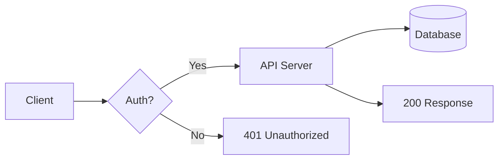
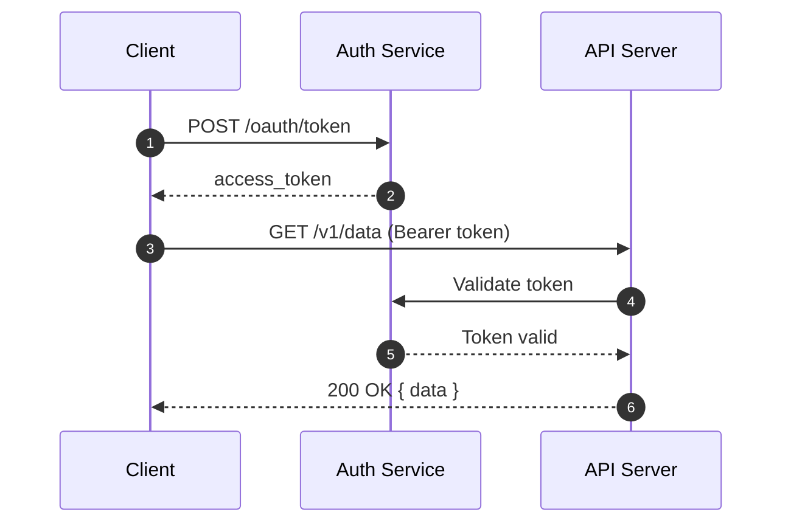
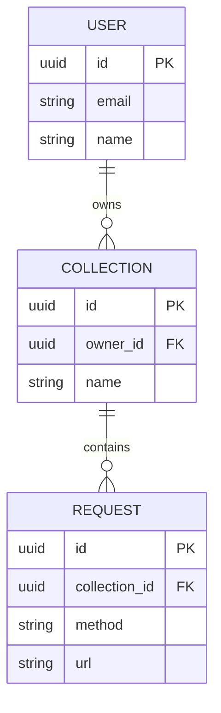
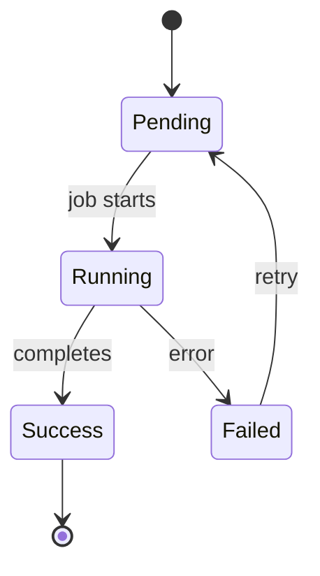

# Diagrams

Material for MkDocs renders [Mermaid.js](https://mermaid.js.org/) diagrams natively.
Write diagrams as fenced code blocks — no plugins or image exports needed.

## Configuration

```yaml
markdown_extensions:
  - pymdownx.superfences:
      custom_fences:
        - name: mermaid
          class: mermaid
          format: !!python/name:pymdownx.superfences.fence_code_format
```

---

## Flowchart

Use flowcharts to illustrate processes, decision trees, and request lifecycles.

````markdown

````

**Result:**


---

## Sequence Diagram

Sequence diagrams show message exchanges between actors over time —
perfect for documenting authentication flows and API handshakes.

````markdown

````

**Result:**


---

## Entity Relationship Diagram

Use ERDs to document data models and database schemas.

````markdown

````

**Result:**


---

## State Diagram

State diagrams are useful for documenting lifecycle states — webhooks, job queues,
order statuses, and more.

````markdown

````

**Result:**


---

## Tips

- Mermaid diagrams adapt automatically to light and dark mode.
- Keep diagrams small and focused — one concept per diagram is easier to read.
- For complex architecture diagrams, consider splitting into multiple focused diagrams
  rather than one large one.
- Full Mermaid syntax reference: [mermaid.js.org](https://mermaid.js.org/intro/)
