# Task 4 — Managing Collections in Postman

## Overview

Collections allow you to group, organize, and share related API requests. This task walks you through exporting a collection as a JSON file, importing it into Postman, and running all requests in a collection at once. By the end of this task, you will be able to transfer collections between workspaces and verify that imported requests execute correctly.

---

## Exporting a Collection

Exporting a collection produces a JSON file that can be shared with teammates or stored in version control, making it easy to synchronize API workflows across different environments and team members.

1. In the left sidebar, click **Collections** and locate the collection you wish to export. In this example, we will use the **REST API basics: CRUD, test & variable** collection — feel free to use whichever collection you currently have. If you do not have a collection yet, refer to [Task 3](#) to create one first.

    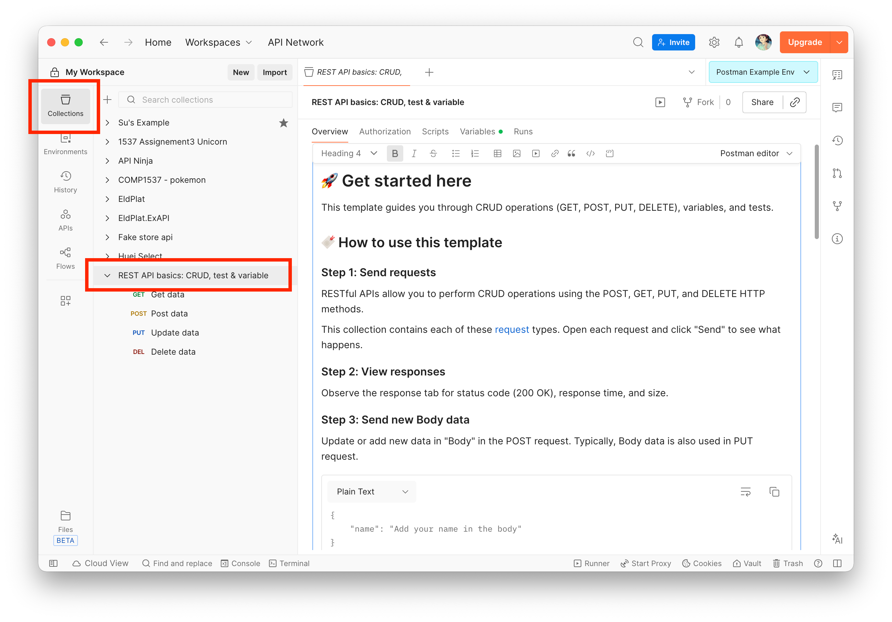

2. Hover over the collection name until the **⋯** icon appears. Click it to open the context menu, then hover over **More** and select **Export**.

    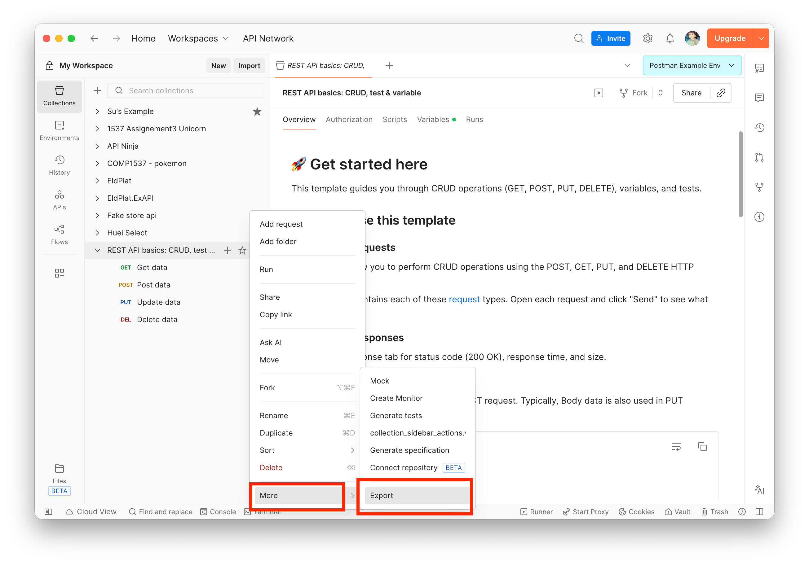

3. A dialog will appear offering sharing options. Click **Continue with Export** in the bottom-right corner to proceed with a local file export.

    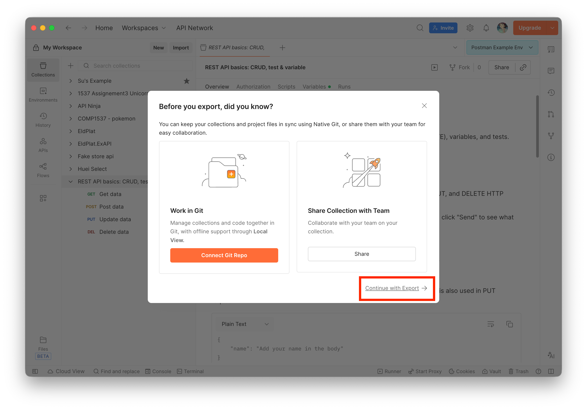

4. In the next dialog, click the **Export** button in the bottom-right corner.

    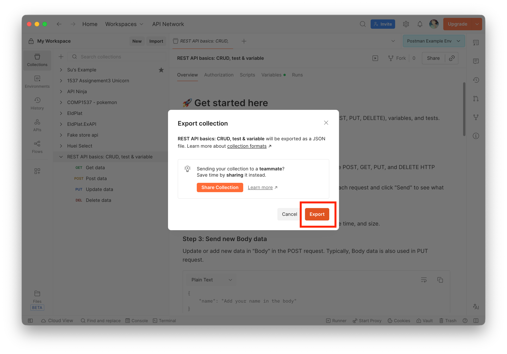

5. Your operating system will prompt you to choose a save location. Select a destination folder, keep the default filename provided by Postman, and click **Save**.

    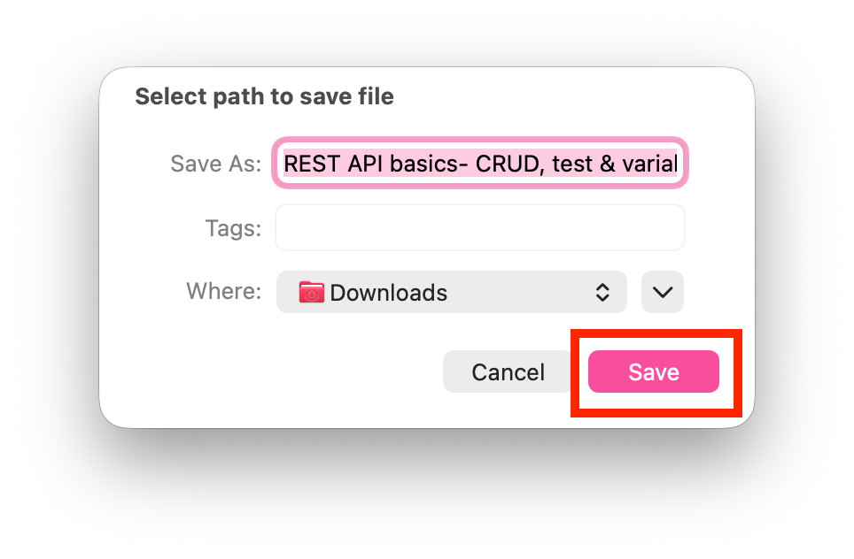

!!! success
    Your collection has been exported as a `.json` file and is ready to be shared or imported into another Postman workspace. Keep this file handy — you will use it in the next section.

---

## Importing a Collection

The steps below use the `.json` file exported in the previous section. However, any valid Postman collection JSON file can be imported using the same process, including collections shared by teammates.

1. Click the **Import** button in the **My Workspace** top bar.

    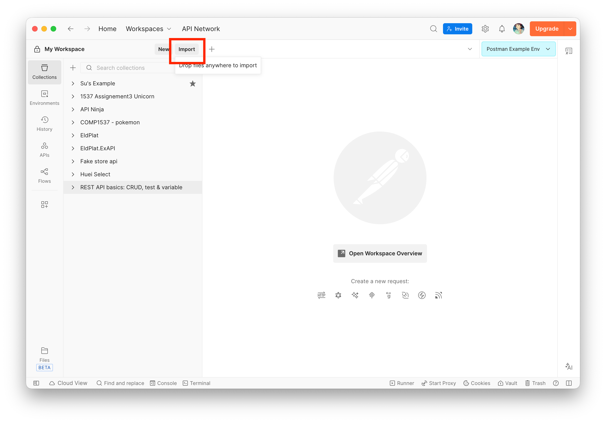

2. In the dialog that appears, click the **files** link to import from a local file.

    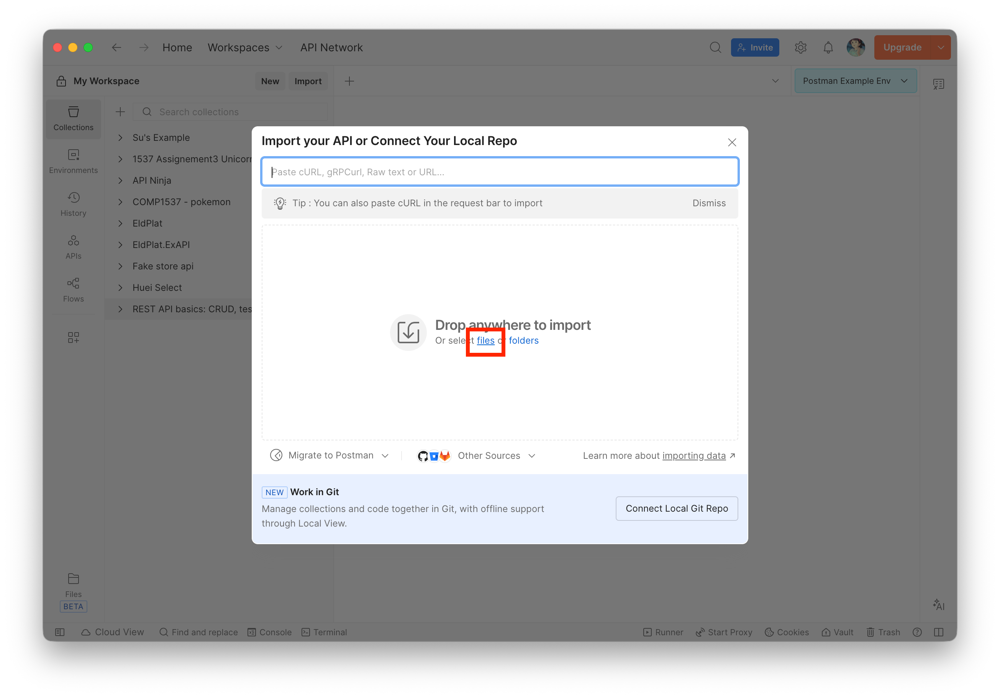

3. Your system file browser will open. Navigate to the folder containing your `.json` file, select it, and click **Open**.

    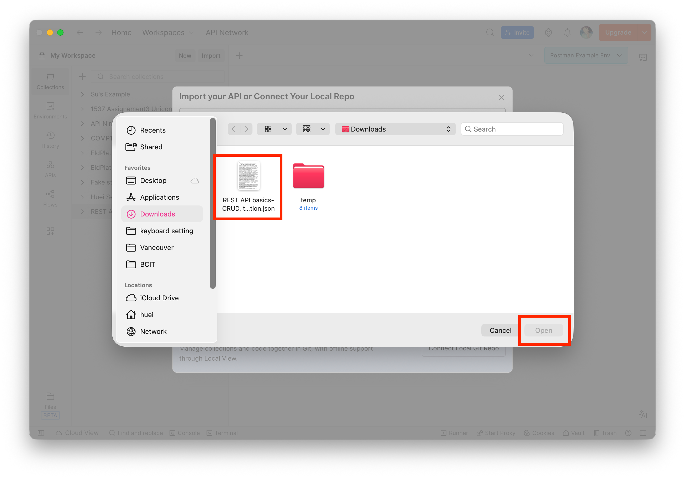

4. If the collection already exists in your workspace, Postman will display a conflict dialog. Click **Import as Copy** to import it without overwriting the existing collection.

    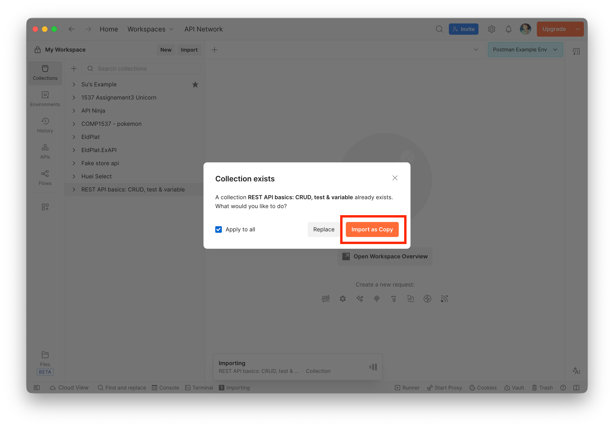

5. The collection will now appear in your **Collections** sidebar, ready for use.

    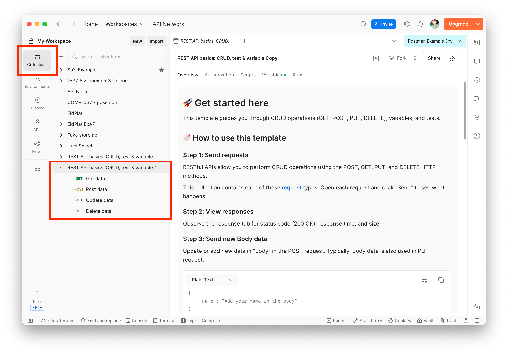

!!! success
    Your collection has been successfully imported into your Postman workspace. You can now access all of its saved requests and continue testing your APIs.

---

## Running a Collection (Optional)

This section is optional. Running the imported collection is a quick way to verify that it was imported correctly and that all requests execute as expected.

The Collection Runner allows you to execute all requests in a collection sequentially, which is useful for end-to-end testing.

1. In the top bar, click the **Run collection** icon (the arrow display icon).

    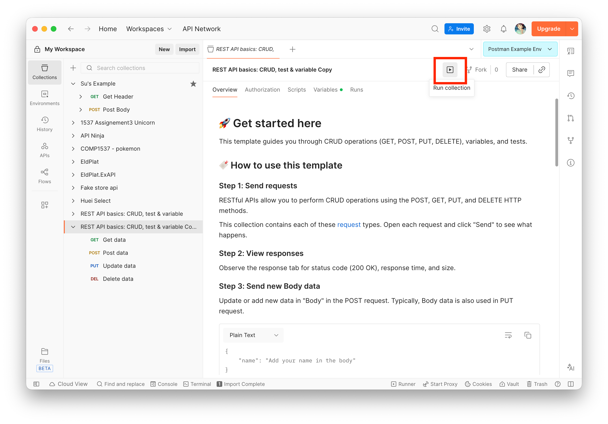

2. The **Runner** tab will open. In the **Run Sequence** panel, select the requests you want to include, then click **Run [your collection name]** in the bottom-right corner.

    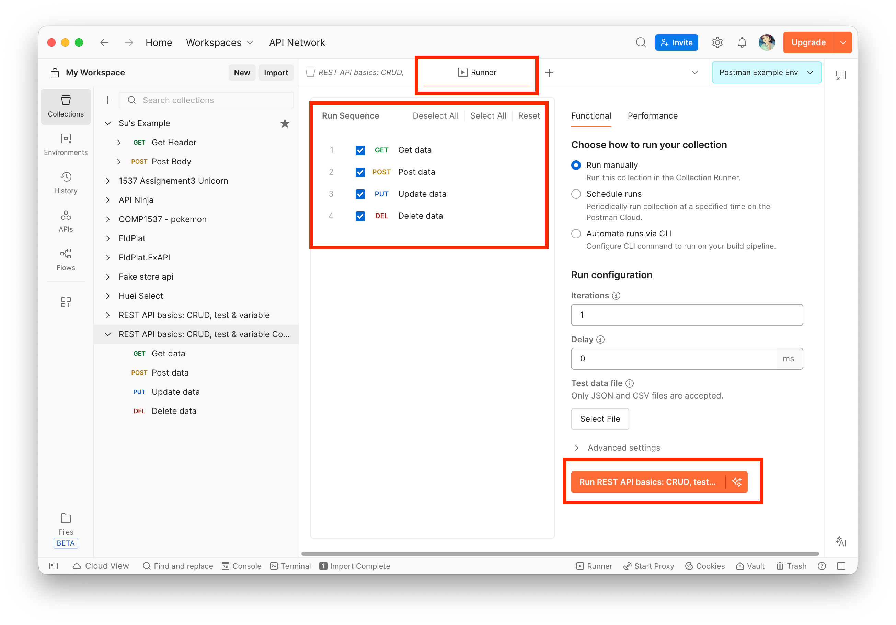

3. Postman will execute each selected request in order. Once complete, the results panel will display the status of every request.

    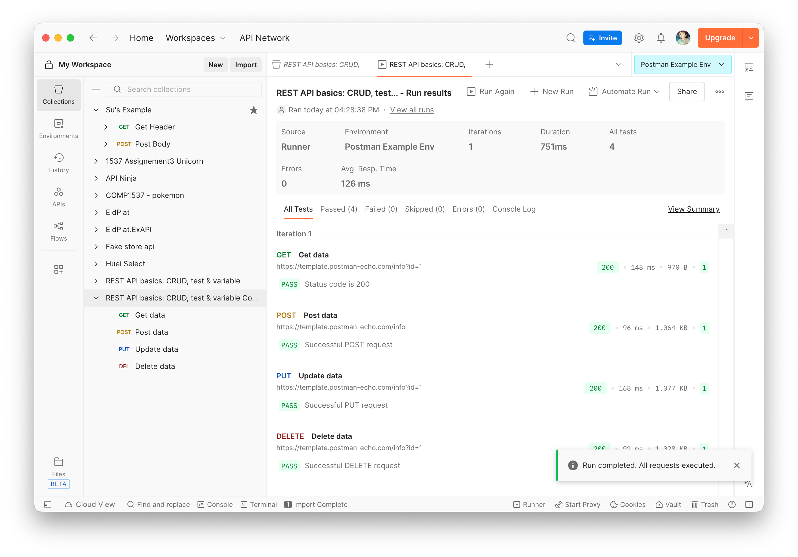

!!! warning
    If any requests fail, check whether they reference environment or collection variables. Variable names highlighted in red indicate that the variable is undefined or not applied. Refer to the [Collection Variable Errors](#collection-variable-errors) section below to resolve this.

---

## Collection Variable Errors

If a collection runner fails or a request behaves unexpectedly, the issue may be related to misconfigured variables. There are two types of variables to check.

**Environment variables** are configured at the workspace level. Refer to [Task 2](#) for instructions on setting up environment variables.

**Collection-level variables** are scoped to a specific collection and are configured as follows:

1. A variable name displayed with a red background in the request editor indicates that it is not currently defined or active.

    

2. Click your collection name in the sidebar, then select the **Variables** tab. Ensure that the checkbox next to each variable you are using is ticked. In the example below, `base_url` was unchecked — checking it resolves the issue.

    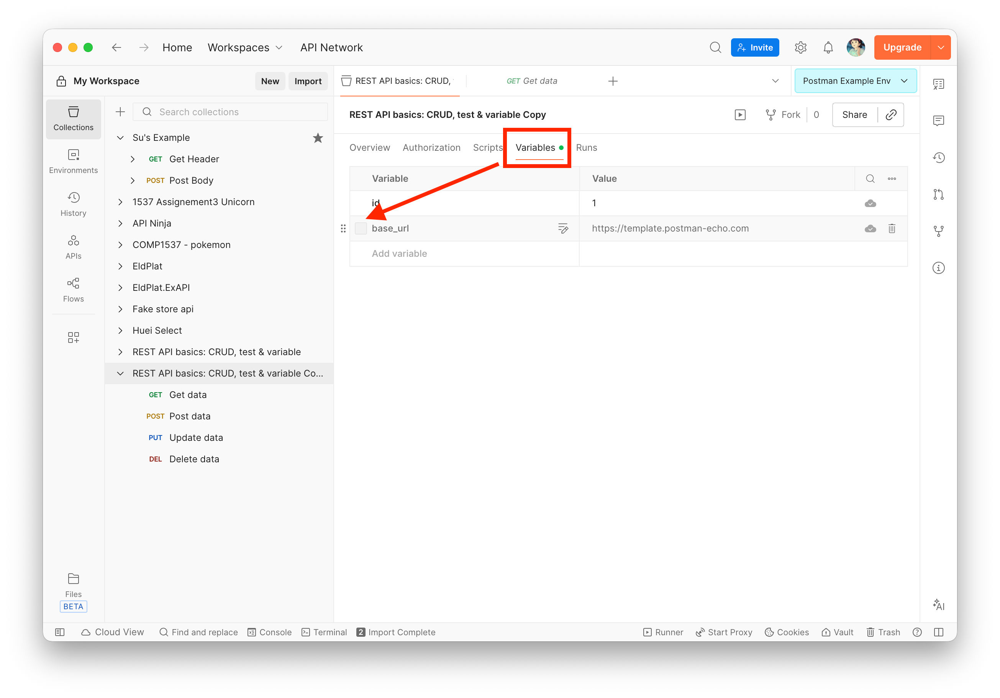

3. Return to the request. The variable name should now appear in blue, indicating it is correctly resolved. Re-run the request to confirm it executes successfully.

    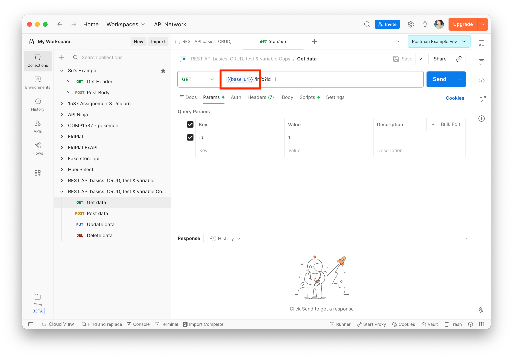

---

## Conclusion

After completing this task, you should be able to:

- **Export a collection** as a `.json` file for sharing or backup
- **Import a collection** from a local file into any Postman workspace
- **Run a collection** using the Collection Runner to execute multiple requests sequentially
- **Diagnose variable errors** by checking both environment and collection-level variable configurations