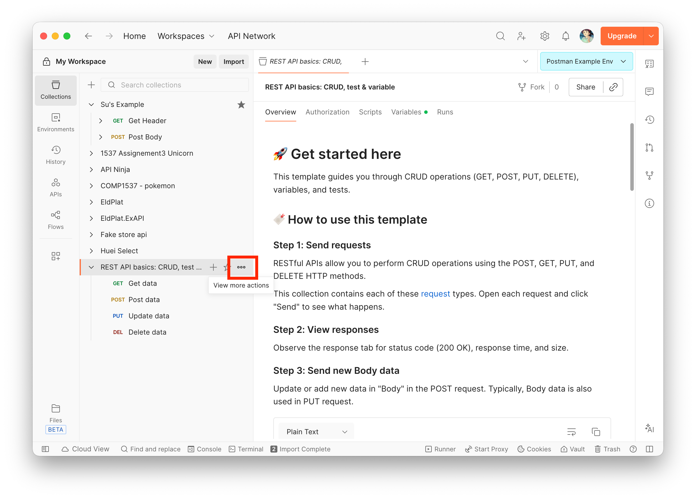

# Managing Collections in Postman

## Overview

Collections allow you to group, organize, and share related API requests. This task walks you through exporting a collection as a JSON file, importing it into Postman, and running all requests in a collection at once. By the end of this task, you will be able to transfer collections between workspaces and verify that imported requests execute correctly.

---

## Exporting a Collection

Exporting a collection produces a JSON file that can be shared with teammates or stored in version control, making it easy to synchronize API workflows across different environments and team members.

1. In the left sidebar, click **"Collections"** and locate the collection you wish to export. In this example, we will use the **REST API basics: CRUD, test & variable** collection — feel free to use whichever collection you currently have. If you do not have a collection yet, refer to [Grouping Requests with Collections](Task3.md/#set-up) to create one first.

    

2. Hover over the collection name until the **"⋯"** icon appears.

    
Click it to open the context menu, then hover over **"More"** and select **"Export"**.
    

3. A dialog will appear offering sharing options. Click **"Continue with Export"** in the bottom-right corner to proceed with a local file export.

    

4. In the next dialog, click the **"Export"** button in the bottom-right corner.

    

5. Your operating system will prompt you to choose a save location. Select a destination folder, keep the default filename provided by Postman, and click **"Save"**.

    

Your collection has been exported as a `.json` file and is ready to be shared or imported into another Postman workspace. Keep this file handy — you will use it in the next section.

---

## Importing a Collection

The steps below use the `.json` file exported in the previous section. However, any valid Postman collection JSON file can be imported using the same process, including collections shared by teammates.

1. Click the **"Import"** button in the **"My Workspace"** top bar.

    

2. In the dialog that appears, click the **"files"** link to import from a local file.

    

3. Your system file browser will open. Navigate to the folder containing your `.json` file, select it, and click **"Open"**.

    

4. If the collection already exists in your workspace, Postman will display a conflict dialog. Click **"Import as Copy"** to import it without overwriting the existing collection.

    

5. The collection will now appear in your **"Collections"** sidebar, ready for use.

    

Your collection has been successfully imported into your Postman workspace. You can now access all of its saved requests and continue testing your APIs.

## Conclusion

After completing this task, you should be able to:

- **Export a collection** as a `.json` file for sharing or backup
- **Import a collection** from a local file into any Postman workspace
